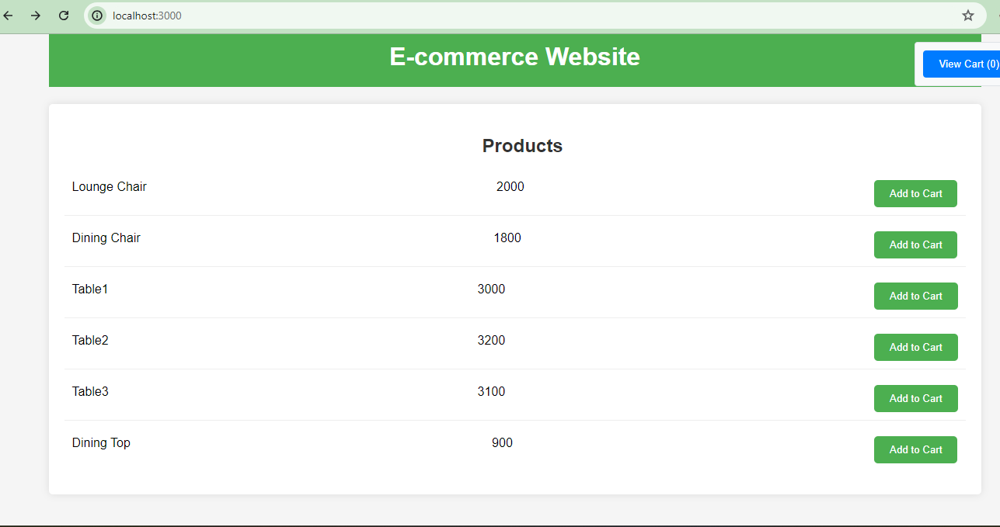
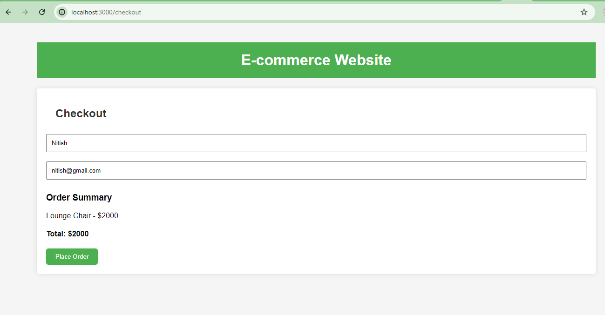
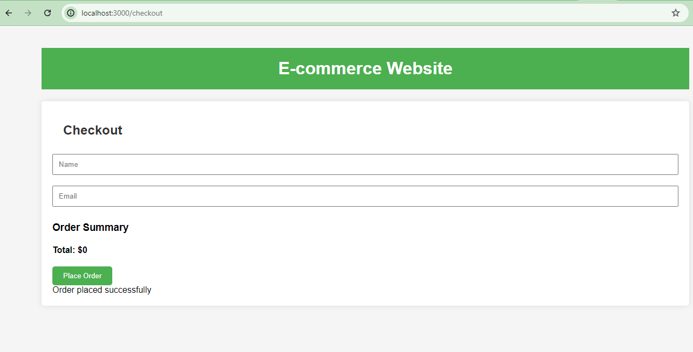

# E-commerce Website

This is an e-commerce website that displays various products, allows users to add them to the cart, and proceed to checkout while collecting basic user information.

## Technologies

- **Frontend**: React, Redux
- **Backend**: Node.js
- **Database**: MySQL

## Installation

1. **Clone the repository**:

    ```bash
    git clone https://github.com/yourusername/Ecommerce.git
    cd Ecommerce
    ```

2. **Install dependencies**:

    ```bash
    npm install
    ```

3. **Configure the database connection**:

    Update the `config/db.js` file with your MySQL database credentials:

    ```javascript
    const config = {
        user: 'your-username',
        password: 'your-password',
        host: 'localhost',
        database: 'ecommerce',
        port:'your-port'
    };

    module.exports = config;
    ```

4. **Start the server**:

    ```bash
    node server.js
    ```

5. **Test the database connection**:

    Visit `http://localhost:5000` to ensure the backend is connected to the database.

## Endpoints

- **POST /api/checkout**: Handle the checkout process


## Frontend UI

The frontend is built with React and Redux. The main pages include:

1. **Home Page**:
    

2. **Order Page**:
    

3. **Order Completed Page**:
    